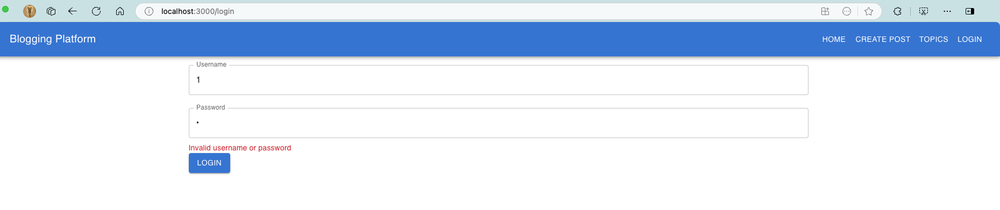
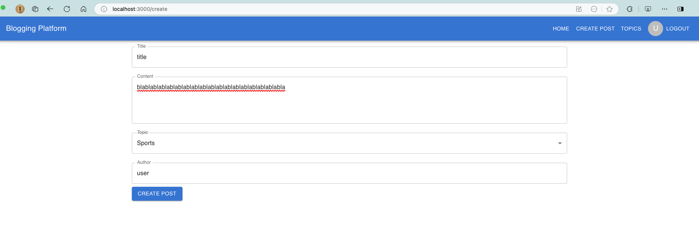
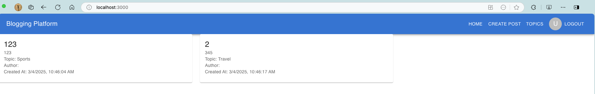
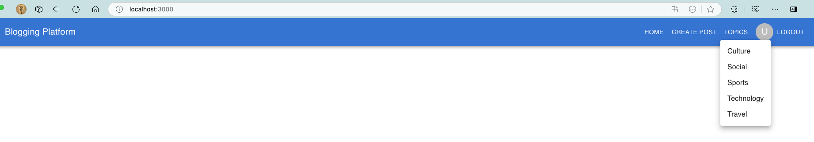

# Lab 4

Consider the following Requirements Specification Document [Blogging Platform - Requirements Specification-2.pdf](./Blogging%20Platform%20-%20Requirements%20Specification-2.pdf), for a Blogging platform of your school/department that you have been asked to design and develop:

## 1. What is/are the React/Material UI component(s) that you will use for the topics navigation bar? Show sample code-snippet

Answer:  
I use AppBar, Toolbar, Button, Menu and MenuItem of MaterialUI's component to build my topics navigation bar 'Navbar'. Below is navbar.js code snippt.  

### Navbar.js

```javascript
import React, { useState } from 'react';
import AppBar from '@mui/material/AppBar';
import Toolbar from '@mui/material/Toolbar';
import Typography from '@mui/material/Typography';
import Button from '@mui/material/Button';
import Menu from '@mui/material/Menu';
import MenuItem from '@mui/material/MenuItem';

const Navbar = () => {
  const [anchorEl, setAnchorEl] = useState(null);

  const handleClick = (event) => {
    setAnchorEl(event.currentTarget);
  };

  const handleClose = () => {
    setAnchorEl(null);
  };

  return (
    <AppBar position="static">
      <Toolbar>
        <Typography variant="h6" style={{ flexGrow: 1 }}>
          Blogging Platform
        </Typography>
        <Button color="inherit" onClick={handleClick}>
          Topics
        </Button>
        <Menu
          anchorEl={anchorEl}
          open={Boolean(anchorEl)}
          onClose={handleClose}
        >
          <MenuItem onClick={handleClose}>Culture</MenuItem>
          <MenuItem onClick={handleClose}>Social</MenuItem>
          <MenuItem onClick={handleClose}>Sports</MenuItem>
          <MenuItem onClick={handleClose}>Technology</MenuItem>
          <MenuItem onClick={handleClose}>Travel</MenuItem>
        </Menu>
        <Button color="inherit">Login</Button>
      </Toolbar>
    </AppBar>
  );
};

export default Navbar;
```

## 1. What is/are the React/Material UI component(s) that you will use to create a post? Show sample code-snippet

Answer:  
I use TextField, Button, Container, FormControl, MenuItem, InputLabel, Select in my create post page. The code of PostForm.js lists below.

### PostForm.js

```javascript
import React, { useState } from 'react';
import { TextField, Button, Container, FormControl, MenuItem, InputLabel, Select } from '@mui/material';

const PostForm = ({ addPost, topics }) => {
  const [title, setTitle] = useState('');
  const [content, setContent] = useState('');
  const [topic, setTopic] = useState('');

  const handleSubmit = (e) => {
    e.preventDefault();
    addPost({ title, content });
    setTitle('');
    setContent('');
    setTopic('');
  };

  return (
    <Container>
      <form onSubmit={handleSubmit}>
        <TextField
          label="Title"
          value={title}
          onChange={(e) => setTitle(e.target.value)}
          fullWidth
          margin="normal"
        />
        <TextField
          label="Content"
          value={content}
          onChange={(e) => setContent(e.target.value)}
          fullWidth
          margin="normal"
          multiline
          rows={4}
        />
        <FormControl fullWidth margin='normal'>
          <InputLabel>Topic</InputLabel>
          <Select
            value={topic}
            onChange={(e) => setTopic(e.target.value)}
          >
            {topics.map((topic, index) => (
              <MenuItem key={index} value={topic}>{topic}</MenuItem>
            ))}
          </Select>
        </FormControl>
        <Button type="submit" variant="contained" color="primary">
          Create Post
        </Button>
      </form>
    </Container>
  );
};

export default PostForm;
```

## 1. Discuss how you will store the list of posts for every topic. Show sample code-snippet.

Answer:
Generally speaking, in React, we use useState to save the states of posts.

The major steps and responsibilities are:

1. PostForm.js, used as a form for create post, save it to post list.
1. PostList.js, used as a repository of posts, showing each post's title, content and topic.
1. App.js, the codinator of above two components, it use 'addPost' to save post into post list, and pass that function to PostForm.js.

The structure of post itself is straigtfoward, it has title, topic, author and createAt properties.

Code snippet list below.

### PostList.js

```javascript
import React from 'react';
import { Grid, Card, CardContent, Typography } from '@mui/material';

const PostList = ({ posts }) => {
  return (
    <Grid container spacing={3}>
      {posts.map((post, index) => (
        <Grid item xs={12} sm={6} md={4} key={index}>
          <Card>
            <CardContent>
              <Typography variant="h5" component="div">
                {post.title}
              </Typography>
              <Typography variant="body2" color="text.secondary">
                {post.content}
              </Typography>
              <Typography variant="body2" color="text.secondary">
                Topic: {post.topic}
              </Typography>
              <Typography variant="body2" color="text.secondary">
                Author: {post.author}
              </Typography>
              <Typography variant="body2" color="text.secondary">
                Created At: {new Date(post.createdAt).toLocaleString()}
              </Typography>
            </CardContent>
          </Card>
        </Grid>
      ))}
    </Grid>
  );
};

export default PostList;
```

## 1. Discuss how you will store the list of logins/users. Show sample code-snippet

I use localStorage to implement a simple login and authentication function in React.js. The major componenet in React I used are TextField, useNavigate from react-router-dom. In order to implement redirect after login. Here's code snippet.

### Login.js

```javascript
import React, { useState } from 'react';
import { TextField, Button, Container, Typography } from '@mui/material';
import { useNavigate } from 'react-router-dom';

const Login = ({ setAuth }) => {
  const [username, setUsername] = useState('');
  const [password, setPassword] = useState('');
  const [error, setError] = useState('');
  const navigate = useNavigate();

  const users = {
    admin: 'admin',
    user: 'user'
  };

  const handleSubmit = (e) => {
    e.preventDefault();
    if (users[username] && users[username] === password) {
      localStorage.setItem('auth', JSON.stringify({ username }));
      setAuth({ username });
      navigate('/');
    } else {
      setError('Invalid username or password');
    }
  };

  return (
    <Container>
      <form onSubmit={handleSubmit}>
        <TextField
          label="Username"
          value={username}
          onChange={(e) => setUsername(e.target.value)}
          fullWidth
          margin="normal"
        />
        <TextField
          label="Password"
          type="password"
          value={password}
          onChange={(e) => setPassword(e.target.value)}
          fullWidth
          margin="normal"
        />
        {error && (
          <Typography color="error" variant="body2">
            {error}
          </Typography>
        )}
        <Button type="submit" variant="contained" color="primary">
          Login
        </Button>
      </form>
    </Container>
  );
};

export default Login;
```

You are allowed to use OpenAI ChatGPT model gpt-4o-mini, however, you must analyze/synthesize ChatGPT results.

---

## Initialize frontend project

1. create a root folder for the code repository, 'iit_blogger_src'  
1. set up npm proxy and https_proxy same with those two settings in environment.  
add 'http://' as starting string in ~/.zshenv  
`npm config proxy $http_proxy`  
`npm config https-proxy $https_proxy`  

1. run npx command to install react framework and get it run  

```shell
npx create-react-app frontend
cd frontend
npm start
```

1. Install material UI and react components used.
`npm install @mui/material @emotion/react @emotion/styled`  
`npm install react-router-dom`

## Screen shots of the project

### Login



### Create a Post



### Post List



### Topics in navibar

